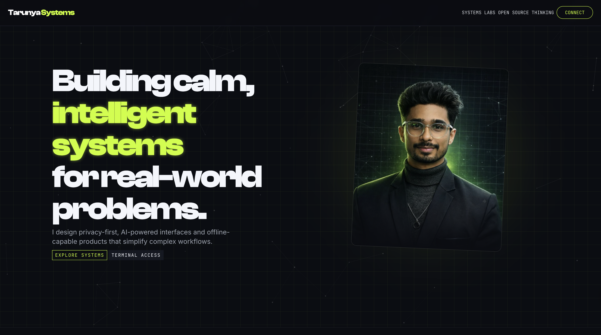

# <div align="center">TARUNYA SYSTEMS</div>

<div align="center">
  <br />
    <a href="https://tarunyaportfolio.vercel.app/" target="_blank">
      
    </a>
    
    
    
  <br />
</div>

<br />

<div align="center">
  
  <!--  -->
</div>

<div align="center">
  <h3>SYSTEM ARCHITECTURE & ENGINEERING PRECISION</h3>
  <p>A high-performance, production-ready System-Design Portfolio built for the modern web. <br /> Designed with a "terminal-chic" aesthetic, prioritizing accessibility, performance, and responsive motion.</p>
</div>

<br />

## ⚡ System Status

> **OPERATIONAL**: All systems normal.

[**INITIATE SEQUENCE: VIEW LIVE DEMO**](https://tarunyaportfolio.vercel.app/)

---

## 🏗 Architecture & Tech Stack

This system is engineered using a cutting-edge stack to ensure maximum efficiency and performance.

| Core Module | Technology | Purpose |
| :--- | :--- | :--- |
| **Engine** | `React 18` | Component-based UI Architecture |
| **Bundler** | `Vite` | Next-generation frontend tooling & HMR |
| **Styling** | `Tailwind CSS` | Utility-first, atomic CSS framework |
| **Motion** | `Framer Motion` | Production-ready declarative animations |
| **Physics** | `tsParticles` | Lightweight particle engine for visual FX |
| **Scrolling** | `Lenis` | Smooth, inertia-based scrolling interface |
| **Routing** | `React Router 6` | Client-side routing with lazy loading |

---

## 💠 Design Philosophy

- **Visual Language**: Deep space contrast with neon lime accents (`#c8ff00`)
- **Typography**:
  - `Clash Display` (Display Headers)
  - `Inter` (Body Text)
  - `JetBrains Mono` (Code & Data)
- **Kinetic Physics**: Precision-tuned ease curves `cubic-bezier(0.2, 0.8, 0.2, 1)` for fluid interaction.

---

## 🛠 Local Deployment Protocol

Follow these commands to clone and initialize the system locally.

### 1. Clone Repository
```bash
git clone https://github.com/TarunyaProgrammer/Portfoilio.git
cd Portfoilio
```

### 2. Install Dependencies
```bash
npm install
```

### 3. Initialize Dev Server
```bash
npm run dev
```

> The system will come online at `http://localhost:5173`

---

## 📂 Project Structure

```bash
/src
├── components/   # Reusable UI blocks (Hero, SystemsGrid, etc.)
├── pages/        # Route views (Lazy loaded)
├── styles/       # Global styles & strict token mapping
└── assets/       # Static assets & media
```

---

## 🔒 License

**© 2024 - Present | Tarunya Ksh. All Rights Reserved.**

This project is licensed under the **Creative Commons Attribution-NonCommercial-NoDerivatives 4.0 International Public License (CC BY-NC-ND 4.0)**.

You are free to:
- **Share** — copy and redistribute the material in any medium or format.

Under the following terms:
- **Attribution** — You must give appropriate credit, provide a link to the license, and indicate if changes were made.
- **NonCommercial** — You may not use the material for commercial purposes.
- **NoDerivatives** — If you remix, transform, or build upon the material, you may not distribute the modified material.

[View Full License](LICENSE)

---

<div align="center">
  <p>End of Transmission</p>
  <sub>Engineered by Tarunya Ksh</sub>
</div>
